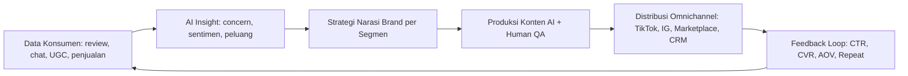
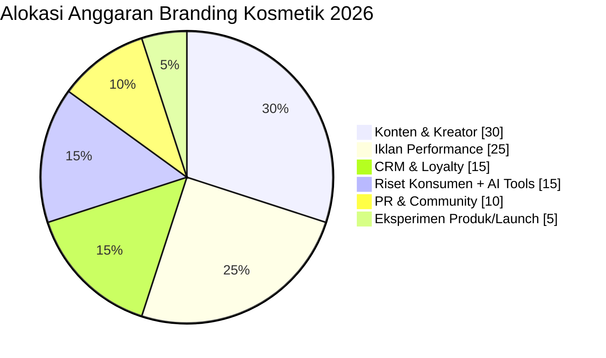
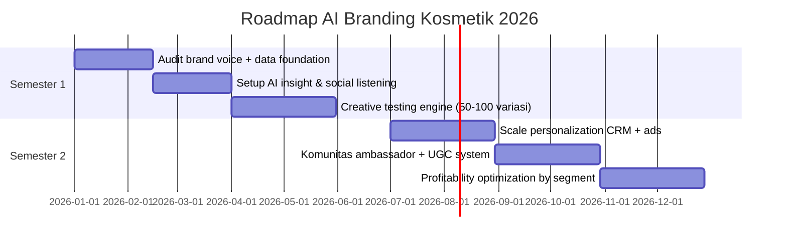

# AI dan Branding untuk Bisnis Kosmetik di 2026

## Ringkasan Eksekutif
Di 2026, pemenang kategori kosmetik bukan hanya yang paling sering iklan, tapi yang paling cepat membaca sinyal pasar dan mengubahnya jadi narasi brand yang konsisten. AI dipakai untuk mempercepat riset, produksi konten, personalisasi, dan optimasi kampanye, sementara branding menjaga diferensiasi, trust, dan loyalitas.

## Target Bisnis 2026
- Menaikkan repeat purchase rate minimal 25%.
- Menurunkan CAC 15-20% lewat optimasi kreatif berbasis AI.
- Menaikkan kontribusi penjualan dari komunitas/UGC ke >30%.
- Menjaga gross margin dengan pricing premium yang tetap diterima pasar.

## Strategi Inti: 6 Pilar
1. Positioning berbasis problem kulit spesifik (bukan sekadar klaim generik).
2. Brand voice konsisten di semua channel: edukatif, empatik, evidence-based.
3. AI insight engine untuk analisis review, komentar, dan tren beauty.
4. Creative factory berbasis AI untuk produksi variasi konten cepat.
5. Hyper-personalization untuk segmentasi concern kulit dan lifecycle customer.
6. Trust architecture: transparansi bahan, bukti, before-after yang etis, dan social proof.

## AI Branding Flywheel

## Grafik 1 - Prioritas Anggaran Branding 2026

## Grafik 2 - Roadmap Implementasi 2 Semester

## Blueprint Konten per Funnel
| Funnel | Tujuan | Format Utama | Peran AI |
|---|---|---|---|
| Awareness | Reach + memorability | Short video hook, creator seeding | Ide angle, script variasi, trend scan |
| Consideration | Edukasi + trust | Demo produk, ingredient education, FAQ | Ringkas insight review, FAQ generation |
| Conversion | Dorong pembelian | Offer, bundle, urgency, landing copy | Dynamic copy per segmen, A/B headline |
| Loyalty | Repeat + advocacy | CRM flows, challenge, referral | Prediksi churn, rekomendasi produk next-best |

## Matrix Brand Voice (Contoh)
- Hero message: "Kulit sehat itu terukur, bukan tebak-tebakan."
- Tone: hangat, ilmiah-praktis, anti-overselling.
- Words to use: "teruji", "bertahap", "sesuai kondisi kulit".
- Words to avoid: "instan", "pasti cocok untuk semua", "hasil permanen".

## KPI Dashboard Wajib
- Growth: Revenue, AOV, CVR, CAC, MER.
- Brand: Share of search, sentiment positif, branded content save/share rate.
- Loyalty: Repeat 30/60/90 hari, subscription uptake, referral rate.
- Creative: Hook rate 3 detik, hold rate, CTR per angle, fatigue score.

## Rencana Eksekusi 30-60-90 Hari
- 30 hari: audit data, tetapkan brand voice bible, bangun prompt library.
- 60 hari: jalankan eksperimen konten mingguan dan segmentasi CRM dasar.
- 90 hari: scale kampanye pemenang, matikan angle lemah, dan optimasi margin.

## Checklist Operasional Mingguan
- [ ] Update insight konsumen dari review + komentar.
- [ ] Produksi minimal 20 variasi kreatif berbasis 5 angle utama.
- [ ] Uji 3 penawaran (bundle/price/bonus) per segmen utama.
- [ ] Evaluasi KPI dan dokumentasikan keputusan yang diambil.

## Catatan Penting
AI mempercepat eksekusi, tetapi positioning dan kepercayaan tetap ditentukan kualitas strategi brand. Gunakan AI sebagai akselerator keputusan, bukan pengganti arah brand.
